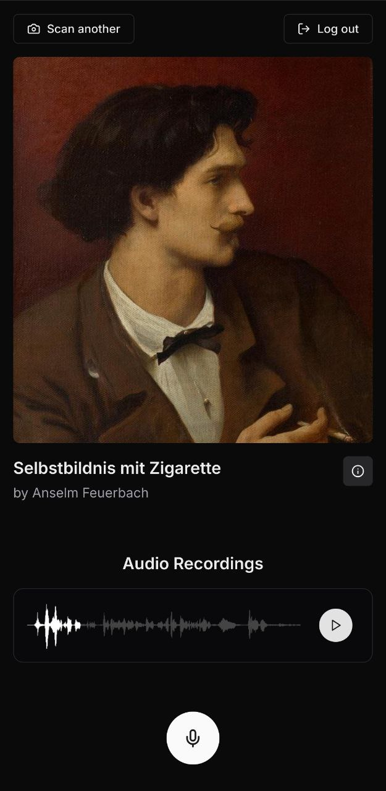

# ArtWhisper




Art Whisper is a unique social experiment to emmers yourself deeply into 
culture. Listening to the thoughts previous visitors had as they inspected the 
same masterpiece. Created in 48hrs during the CultureGameJam 2024 🥳
 
## Build it locally

To build it you need bash, [node](https://nodejs.org/), 
[python](https://www.python.org/), and 
[docker](https://www.docker.com/) installed on your system.

First start the postgres database and the backend with:
```bash
cd backend
./start_postgres.sh
./start.sh
```

Next we need to fill the database with the artworks from the current collection:
```bash
cd crawler
./start.sh
```

With that we can now finally start the frontend and access the page:
```bash
cd frontend
npm i
npm run dev
```

Now the frontend should be running on [localhost:3000](http://localhost:3000)
and the backend on [localhost:8000](http://localhost:8000). 🎉

## Development

Contributions are quite welcome, you are awesome 🎉😊.

For python code we use [ruff](https://github.com/astral-sh/ruff) or 
[black](https://github.com/psf/black) (both compatible) to format the code and
for typescript we use [prettier](https://prettier.io/).
