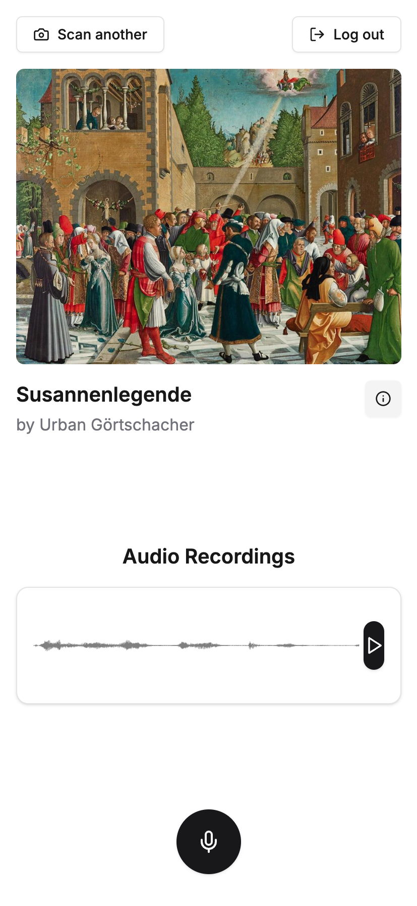

# ArtWhisper



Art Whisper is a unique social experiment to emmers yourself deeply into 
culture. Listening to the thoughts previous visitors had as they inspected the 
same masterpiece.
 
## Build it locally

To build it you need bash, node, python and docker installed on your system.

First start the postgres database and the backend with:
```bash
cd backend
./start_postgres.sh
./start.sh
```

Next we need to fill the database with the artworks from the current collection:
```bash
cd crawler
./start.sh
```

With that we can now finally start the frontend and access the page:
```bash
cd frontend
npm i
npm run dev
```

Now the frontend should be running on [localhost:3000](http://localhost:3000)
and the backend on [localhost:8000](http://localhost:8000). 🎉